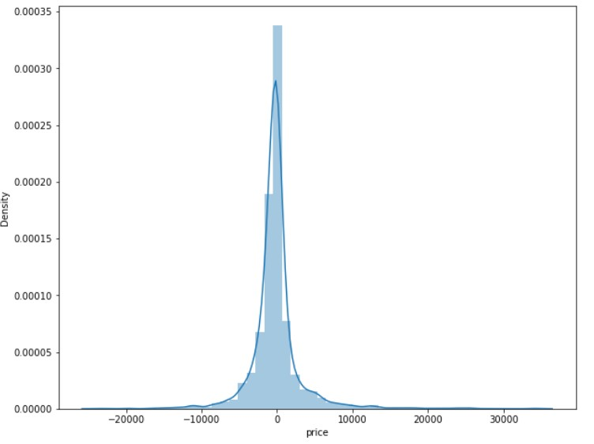

# Flight-Fare-Prediction


Using different regression models and EDA techniques to predict flight prices

## Description

The dataset is an indian dataset taken from kaggle
https://www.kaggle.com/datasets/sanjaromonov/aviachipta-narxini-bashorat-qilish?select=train_data.csv

Data is cleaned first and categories encoded using one-hot-encoding

## Getting Started

### Dependencies

* anaconda
* OR you can use google colab

### Cloning

* Clone the repo
```
git clone https://github.com/imranzaheer612/flight-fare-prediction-regression.git
```



## License

This project is licensed under the [GNU] License - see the LICENSE.md file for details

## Acknowledgments

This articles helped a lot.

* [anurag2405/flight-price-prediction](https://www.kaggle.com/code/anurag2405/flight-price-prediction)
* [Rishi Mishra blog in Analytics Vidhya](https://medium.com/analytics-vidhya/the-flight-ticket-price-prediction-in-python-using-scikit-learn-library-ee3aefc01224)
